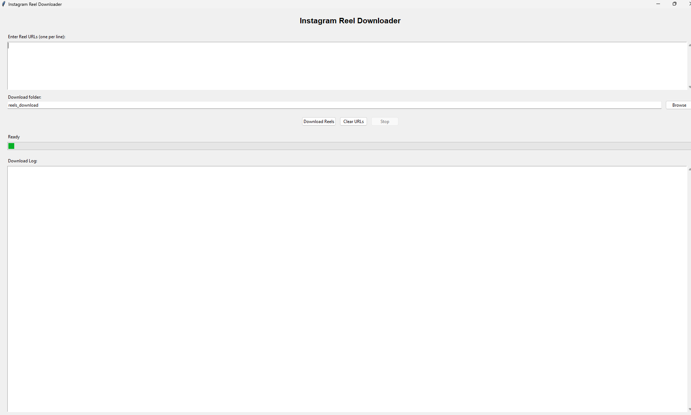
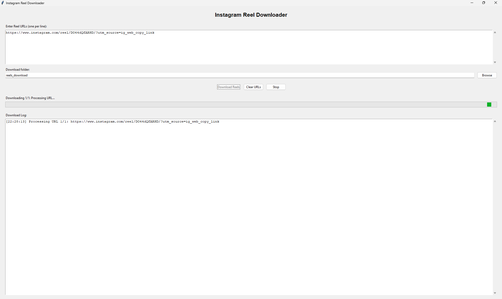
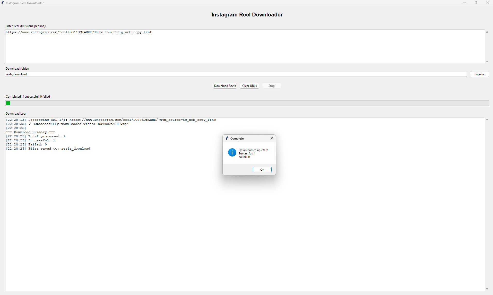

# 📱 Instagram Reel Downloader

A simple, user-friendly GUI application to download Instagram Reels as MP4 files with clean filenames and no metadata clutter.


## ✨ Features

- **🎥 Clean Downloads**: Downloads only MP4 video files, no metadata or extra files
- **🖥️ User-Friendly GUI**: Easy-to-use interface with progress tracking
- **📁 Custom Download Folder**: Choose where to save your videos
- **📊 Real-time Progress**: See download status and success/failure counts
- **🚀 Standalone Executable**: No Python installation required for end users
- **⏸️ Cancellable Downloads**: Stop downloads anytime with the stop button
- **📝 Detailed Logging**: Track all download activities with timestamps

## 🚀 Quick Start

### Option 1: Use the Executable (Recommended)
1. Download `Instagram-Reel-Downloader.exe`
2. Double-click to run
3. Paste Instagram Reel URLs
4. Choose download folder
5. Click "Download Reels"

### Option 2: Run from Source
```bash
# Clone the repository
git clone https://github.com/yourusername/instagram-downloader.git
cd instagram-downloader

# Install dependencies
pip install instaloader requests tkinter

# Run the application
python insta-downloader-gui.py
```

## 📋 Requirements

### For Executable:
- Windows 10/11
- No additional requirements

### For Source Code:
- Python 3.8+
- tkinter (usually comes with Python)
- instaloader
- requests

```bash
pip install instaloader requests
```

## 🖼️ Screenshots

### Main Interface

*Clean, intuitive interface with URL input and download controls*

### Download in Progress

*Real-time progress tracking with detailed logging*

### Download Complete

*Success notification with download summary*

## 📖 How to Use

### 1. Enter URLs
- Paste Instagram Reel URLs in the text area
- One URL per line, or comma-separated
- Example URLs:
  ```
  https://www.instagram.com/reel/ABC123/
  https://www.instagram.com/reel/XYZ789/
  ```

### 2. Choose Download Folder
- Click "Browse" to select where videos will be saved
- Or type the folder path directly
- Folder will be created automatically if it doesn't exist

### 3. Start Download
- Click "Download Reels" to begin
- Watch progress in real-time
- Use "Stop" button to cancel if needed

### 4. View Results
- Downloaded files are saved as `{shortcode}.mp4`
- Check the log for detailed information
- Success/failure summary shown at completion

## 📁 Output Format

Downloads are saved with clean, simple filenames:
```
Your-Download-Folder/
├── CaBcDe123.mp4    ← Reel shortcode as filename
├── XyZ789abc.mp4    ← Another reel
└── MnOpQr456.mp4    ← Clean MP4 files only
```

**No extra files!** Just the video content you want.

## 🛠️ Building from Source

To create your own executable:

```bash
# Install PyInstaller
pip install pyinstaller

# Build executable
pyinstaller --onefile --windowed --name "Instagram-Reel-Downloader" insta-downloader-gui.py

# Find executable in dist/ folder
```

## ⚠️ Important Notes

### Limitations:
- **Public content only**: Private account reels require authentication
- **Instagram's terms**: Respect Instagram's Terms of Service
- **Rate limiting**: Instagram may limit rapid downloads
- **Video format**: Only works with video reels (not photos)

### Legal Considerations:
- Only download content you have permission to download
- Respect copyright and intellectual property rights
- Use downloaded content responsibly
- This tool is for personal use only

## 🐛 Troubleshooting

### Common Issues:

**"Invalid URL format"**
- Ensure URL contains `/reel/` in the path
- Remove any extra parameters or tracking codes
- Use the direct Instagram URL

**"Failed to download"**
- Check if the reel is public
- Verify your internet connection
- Try individual URLs instead of batch download

**"Cannot create download folder"**
- Check folder permissions
- Ensure path doesn't contain invalid characters
- Try a different location like Desktop or Documents

## 🔄 Updates

### Version 1.0.0 (Current)
- Initial release
- GUI interface
- Clean MP4 downloads
- Progress tracking
- Standalone executable

## 🤝 Contributing

1. Fork the repository
2. Create a feature branch: `git checkout -b feature/new-feature`
3. Commit changes: `git commit -am 'Add new feature'`
4. Push to branch: `git push origin feature/new-feature`
5. Submit a pull request

## 📄 License

This project is licensed under the MIT License - see the [LICENSE](LICENSE) file for details.

## 🙏 Acknowledgments

- [Instaloader](https://instaloader.github.io/) - Core Instagram downloading functionality
- [Tkinter](https://docs.python.org/3/library/tkinter.html) - GUI framework
- [Requests](https://requests.readthedocs.io/) - HTTP library for downloading videos

## 📞 Support

If you encounter any issues or have questions:
1. Check the [Troubleshooting](#-troubleshooting) section
2. Look through existing [Issues](https://github.com/yourusername/instagram-downloader/issues)
3. Create a new issue with detailed information

---

**⚠️ Disclaimer**: This tool is for educational and personal use only. Please respect Instagram's Terms of Service and content creators' rights when using this application.